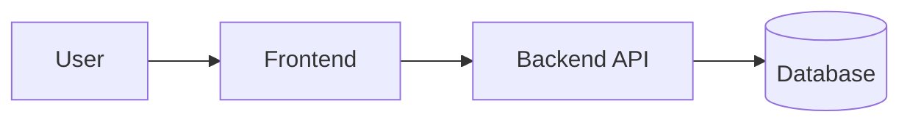
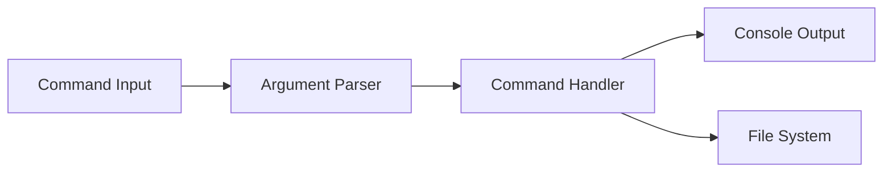
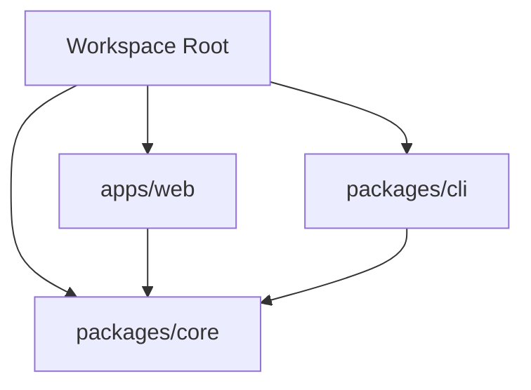
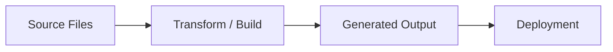

# Mermaid Diagram Starters

Only use a diagram when the repository has multiple meaningful pieces. Rename the nodes to match the actual project.

## Web App + API

## CLI Tool

## Package Workspace

## Content Pipeline

